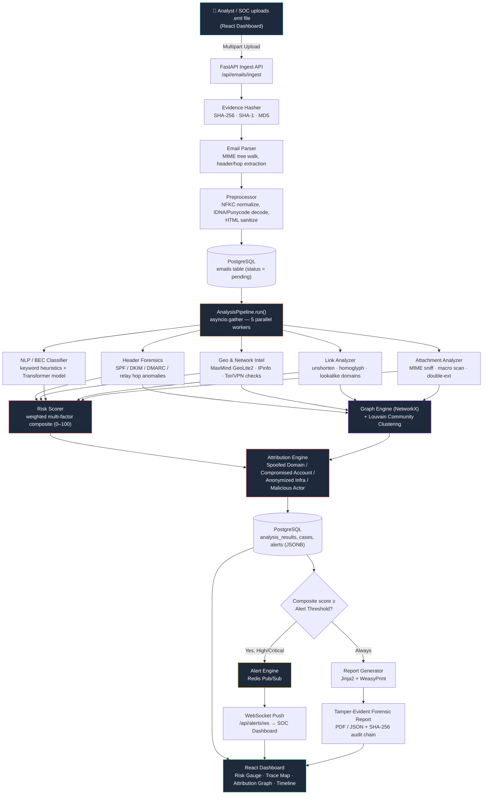

# 🔎 MailForensix — AI-Powered Email Threat Forensics & Attribution Platform

> **Tagline:** *Treat every email like a digital crime scene — parse it, verify it, score it, and prove it.*

MailForensix is not another "is this email phishing?" classifier. It is a **multi-layered digital forensics and threat-attribution platform** that ingests a raw `.eml` file, tears it apart across five independent forensic domains in parallel, correlates the evidence into a single explainable risk score, links related emails into attack campaigns via graph analysis, and produces a court-style, tamper-evident forensic report — automatically.

---

## 📌 Table of Contents

1. [Core Idea](#-core-idea)
2. [System Flow (Mermaid Diagram)](#-system-flow-mermaid-diagram)
3. [Detailed Tech Stack & Implementation](#-detailed-tech-stack--implementation)
4. [Project Structure](#-project-structure)
5. [Getting Started](#-getting-started)
6. [Key API Endpoints](#-key-api-endpoints)
7. [Risk Scoring Model](#-risk-scoring-model)
8. [Sample Data](#-sample-data)
9. [Roadmap](#-roadmap)

---

## 💡 Core Idea

Traditional email security tools inspect a message **in isolation**, using a single signal — SPF/DKIM validity, a spam-word list, or a static blocklist. Attackers routinely bypass this by using **compromised legitimate accounts**, **lookalike domains**, or **freshly registered infrastructure** that has no blocklist history.

MailForensix instead treats every ingested email as **physical evidence at a crime scene**:

1. **Preserve the evidence** — compute SHA-256 / SHA-1 / MD5 hashes at ingestion time for chain-of-custody, before any analysis touches the content.
2. **Decompose it across 5 independent forensic vectors, in parallel:**
   - **Header Forensics** — cryptographic auth (SPF, DKIM, DMARC alignment), relay-hop delay analysis, "time-travel" anomaly detection.
   - **Geo & Network Intelligence** — originating IP resolution, ASN/hosting lookups, Tor exit-node & VPN detection.
   - **NLP / BEC Semantic Engine** — phishing/urgency/BEC keyword and transformer-based classification of subject + body.
   - **Link Analyzer** — URL unshortening, homoglyph & Levenshtein-based brand-lookalike detection.
   - **Attachment Analyzer** — MIME-type sniffing, OLE macro detection, double-extension and archive-bomb checks.
3. **Correlate, don't just classify** — a `NetworkX` graph + Louvain community detection clusters shared infrastructure (IPs, domains, hashes) across many emails to reveal **coordinated campaigns**, not just one-off spam.
4. **Score transparently** — a weighted, multi-factor **Composite Risk Score (0–100)** is computed with a human-readable breakdown of *why* an email is risky, instead of a black-box probability.
5. **Attribute the attacker** — heuristics classify the likely attack pattern (Spoofed Domain, Compromised Account, Anonymized Infrastructure, Compromised Relay, Direct Malicious Actor).
6. **Prove it** — a forensic PDF/JSON report is generated with a SHA-256 **tamper-evident audit hash chain**, suitable for SOC handoff or legal escalation, and real-time alerts are pushed to analysts via WebSocket the moment a critical threat is detected.

In short: **Parse → Verify → Correlate → Score → Attribute → Report**, entirely explainable at every step.

---

## 🗺️ System Flow (Mermaid Diagram)



---

## 🛠️ Detailed Tech Stack & Implementation

### 1. Frontend — Forensic Analyst Dashboard
| Layer | Technology | Purpose |
|---|---|---|
| Framework | **React 18 + TypeScript + Vite** | Sub-second HMR, type-safe component tree |
| Styling | **TailwindCSS + tailwind-merge + tailwindcss-animate** | Utility-first, consistent dark-mode SOC UI |
| UI Primitives | **Radix UI** (dialog, dropdown, tabs, toast, tooltip, select) | Accessible, unstyled building blocks |
| Server State | **TanStack Query (React Query)** | Caching, polling, background refetch of analysis/case data |
| Tables | **TanStack Table** | Sortable/filterable case & email lists |
| Data Viz | **Recharts** | Risk trend charts, dashboard KPIs |
| Graph Viz | **react-force-graph-2d** | Force-directed **attribution graph** of shared infrastructure |
| Geo Viz | **maplibre-gl + react-map-gl** | **Trace Map** — visualizes relay-hop IP geolocation path |
| Icons | **lucide-react** | Icon set |
| File Upload | **react-dropzone** | `.eml` drag-and-drop ingestion |
| Routing | **react-router-dom v6** | SPA routing (Dashboard, Cases, Analysis, Graph, Reports) |
| HTTP Client | **Axios** | Central client in `src/lib/api.ts` |
| Realtime | **Native WebSocket** wrapper (`src/lib/websocket.ts`) | Live alert stream from backend Redis Pub/Sub |

### 2. Backend — API & Orchestration Layer
| Layer | Technology | Purpose |
|---|---|---|
| Framework | **FastAPI + Uvicorn (ASGI)** | Fully async, non-blocking request handling |
| Validation | **Pydantic v2** | Compiled schema validation + auto OpenAPI docs (`/docs`) |
| Auth | **python-jose (JWT) + passlib[bcrypt]** | Token-based auth, hashed credential storage |
| File Handling | **python-multipart** | Multipart `.eml` upload streaming |
| Config | **pydantic-settings** | `.env`-driven `Settings` (DB URL, Redis URL, API keys, risk weights) |
| ORM | **SQLAlchemy 2.0 (async) + asyncpg** | Async Postgres access, JSONB-native models |
| Migrations | **Alembic** | Schema versioning |
| DB | **PostgreSQL 16** | Source of truth: emails, analysis, cases, alerts, audit logs |
| Cache / Broker | **Redis 7** | Pub/Sub for real-time alerts, Celery broker/result backend |
| Background Jobs | **Celery [redis]** | Async re-analysis / long-running forensic tasks |

### 3. Forensic Analysis Engines (`backend/app/core/analysis`)
| Module | Libraries | What it Does |
|---|---|---|
| `header_forensics.py` | `dnspython`, `checkdmarc`, `dkimpy`, `authres`, stdlib `email` | Verifies SPF/DKIM/DMARC alignment, walks `Received:` hops, flags delay/"time-travel" anomalies |
| `geo_intel.py` | `geoip2` (MaxMind GeoLite2), IPinfo API, `httpx` | Resolves originating IP → ASN/city/country, detects Tor exit nodes & known VPN ranges |
| `nlp_classifier.py` | `transformers`, `torch`, `sentence-transformers`, custom keyword-weight tables | Scores phishing/BEC/urgency keyword patterns and runs transformer-based semantic classification |
| `link_analyzer.py` | `tldextract`, `confusables`, custom Levenshtein logic | Unshortens URLs, detects homoglyph/Unicode confusable domains and brand-lookalike typosquats |
| `attachment_analyzer.py` | `python-magic`, custom OLE/archive checks | Detects MIME-type mismatches, macro-enabled Office docs, double extensions, archive risks |

All five run **concurrently** via `asyncio.gather(..., return_exceptions=True)` inside `AnalysisPipeline.run()` — a single slow/failed module (e.g., a DNS timeout) degrades gracefully to a safe default instead of blocking the whole pipeline.

### 4. Correlation & Attribution (`backend/app/core/correlation`)
| Module | Libraries | What it Does |
|---|---|---|
| `risk_scorer.py` | Custom weighted model, config-driven weights | Combines NLP, Auth, IP reputation, Link & Attachment risk into one **Composite Risk Score (0–100)** with per-factor breakdown and severity band |
| `graph_engine.py` | **NetworkX** (multigraph) | Builds an evidence graph linking emails ↔ IPs ↔ domains ↔ hashes |
| `campaign_cluster.py` | **python-louvain** | Community detection on the graph to cluster related emails into likely coordinated **campaigns** |
| `threat_intel.py` | `httpx`, AbuseIPDB / VirusTotal APIs | Enriches IPs/domains/hashes with external threat-intel reputation |
| `cache.py` | Redis | Caches expensive lookups (WHOIS, geo, threat intel) |

### 5. Reporting & Alerting (`backend/app/core/reporting`)
| Module | Libraries | What it Does |
|---|---|---|
| `report_generator.py` + `templates/forensic_report.html` | **Jinja2 + WeasyPrint** | Renders a full forensic HTML/PDF dossier (headers, auth results, hop map, risk breakdown, IOCs) |
| `alert_engine.py` | Redis Pub/Sub, FastAPI WebSocket | Pushes real-time High/Critical alerts to the SOC dashboard the instant a threshold is crossed |

### 6. Machine Learning (`backend/ml`)
| File | Purpose |
|---|---|
| `train_nlp.py` | Fine-tunes / trains the transformer-based phishing & BEC text classifier (`transformers`, `datasets`, `accelerate`) |
| `train_tabular.py` | Trains a **LightGBM** gradient-boosted tabular model on structural/header/link/attachment features |
| `train_ensemble.py` | Combines NLP + tabular model outputs into a **meta-ensemble** (`scikit-learn`, `optuna` for hyperparameter search) |
| `feature_engineering.py` | Shared feature extraction used by both training and inference paths |

### 7. Ingestion & Preprocessing (`backend/app/core/ingestion`)
| Module | Purpose |
|---|---|
| `hasher.py` | Computes SHA-256, SHA-1, MD5 over the raw `.eml` bytes for chain-of-custody |
| `parser.py` | Parses MIME structure, headers, relay hops, attachments, and URLs (`eml-parser`, `email.policy.default`) |
| `preprocessor.py` | NFKC Unicode normalization, IDNA/Punycode decoding, HTML sanitization (`BeautifulSoup4`, `chardet`) |

### 8. Infrastructure
| Tool | Purpose |
|---|---|
| **Docker Compose** | Spins up `postgres:16` and `redis:7-alpine` with health checks for local dev |
| **pytest / pytest-asyncio / pytest-cov** | Backend unit & integration test suite (`backend/tests`) |
| **Alembic** | Versioned DB schema migrations |

---

## 📂 Project Structure

```text
MailForensix/
│
├── backend/
│   ├── app/
│   │   ├── main.py                     # FastAPI app init, CORS, DB lifespan, health check
│   │   ├── config.py                   # Env-driven Settings (DB, Redis, API keys, risk weights, JWT)
│   │   ├── database.py                 # Async SQLAlchemy engine/session setup
│   │   │
│   │   ├── api/                        # HTTP route handlers (thin controllers)
│   │   │   ├── router.py               #   Mounts all sub-routers under /api
│   │   │   ├── auth.py                 #   Login / JWT issuance
│   │   │   ├── ingest.py               #   .eml upload → hash → parse → pipeline dispatch
│   │   │   ├── analysis.py             #   Fetch/trigger forensic analysis results
│   │   │   ├── cases.py                #   Case management (open/investigate/close)
│   │   │   ├── alerts.py               #   Alert feed + WebSocket endpoint
│   │   │   ├── reports.py              #   Forensic PDF/JSON report generation
│   │   │   ├── dashboard.py            #   Aggregate KPIs/stats for the dashboard
│   │   │   └── graph.py                #   Attribution graph / subgraph queries
│   │   │
│   │   ├── core/
│   │   │   ├── pipeline.py             #   AnalysisPipeline — orchestrates the 5 parallel workers
│   │   │   ├── security.py             #   Password hashing, JWT helpers
│   │   │   ├── seed.py                 #   Seeds a default admin user on startup
│   │   │   ├── dependencies.py         #   FastAPI DI (get_db, get_current_user, etc.)
│   │   │   │
│   │   │   ├── ingestion/              #   Hashing, MIME parsing, normalization
│   │   │   │   ├── hasher.py
│   │   │   │   ├── parser.py
│   │   │   │   └── preprocessor.py
│   │   │   │
│   │   │   ├── analysis/               #   The 5 forensic engines (run in parallel)
│   │   │   │   ├── header_forensics.py
│   │   │   │   ├── geo_intel.py
│   │   │   │   ├── nlp_classifier.py
│   │   │   │   ├── link_analyzer.py
│   │   │   │   └── attachment_analyzer.py
│   │   │   │
│   │   │   ├── correlation/            #   Scoring, graphing, clustering, threat intel
│   │   │   │   ├── risk_scorer.py
│   │   │   │   ├── graph_engine.py
│   │   │   │   ├── campaign_cluster.py
│   │   │   │   ├── threat_intel.py
│   │   │   │   └── cache.py
│   │   │   │
│   │   │   └── reporting/              #   Report + alert generation
│   │   │       ├── report_generator.py
│   │   │       ├── alert_engine.py
│   │   │       └── templates/forensic_report.html
│   │   │
│   │   ├── models/                     # SQLAlchemy ORM models (emails, cases, alerts, audit_logs, users, orgs)
│   │   ├── schemas/                    # Pydantic request/response schemas
│   │   ├── services/                   # Business-logic layer (email, case, audit services)
│   │   └── workers/                    # Celery app + background task definitions
│   │
│   ├── ml/                             # Model training pipelines
│   │   ├── train_nlp.py
│   │   ├── train_tabular.py
│   │   ├── train_ensemble.py
│   │   ├── feature_engineering.py
│   │   ├── models/                     # Trained model artifacts (.joblib, HF checkpoints)
│   │   ├── data/                       # Training datasets
│   │   └── notebooks/                  # Exploratory analysis
│   │
│   ├── scripts/                        # Utility/setup scripts
│   ├── tests/                          # pytest suite (unit + integration)
│   └── requirements.txt
│
├── frontend/
│   ├── src/
│   │   ├── main.tsx / App.tsx          # App bootstrap & routing
│   │   ├── pages/                      # Route-level views
│   │   │   ├── DashboardPage.tsx
│   │   │   ├── EmailIngestPage.tsx
│   │   │   ├── EmailAnalysisPage.tsx
│   │   │   ├── CasesPage.tsx
│   │   │   ├── AttributionGraphPage.tsx
│   │   │   ├── TraceMapPage.tsx
│   │   │   ├── ReportsPage.tsx
│   │   │   └── LoginPage.tsx
│   │   ├── components/                 # analysis, cases, dashboard, email, forensics, graph, map, reports, ui, auth, layout
│   │   ├── hooks/                      # useAnalysis, useCases, useAlerts, useEmails, useRole
│   │   ├── context/AuthContext.tsx     # Auth/session state
│   │   ├── lib/                        # api.ts, websocket.ts, severity.ts, dossierGenerator.ts
│   │   └── types/                      # Shared TS types (analysis, case, email, graph, auth, alert)
│   ├── package.json
│   └── vite.config.ts
│
├── sample_emails/                      # sample .eml files: phishing, BEC fraud, legit newsletter, campaign
├── demo/                               # DEMO_SCRIPT.md, seed_demo_data.py, sample reports
├── docker-compose.yml                  # Postgres 16 + Redis 7 for local dev
├── requirements.txt                    # Root/backend Python dependencies
├── pyproject.toml
├── start-all.bat / start-backend.bat / start-frontend.bat   # Windows dev launch scripts
└── README.md
```

---

## 🚀 Getting Started

### Prerequisites
- Python 3.11+
- Node.js 18+
- Docker & Docker Compose

### 1. Clone the repository
```bash
git clone https://github.com/sarthakbhagia/SIH26-MailForensix.git
cd SIH26-MailForensix
```

### 2. Start infrastructure (PostgreSQL + Redis)
```bash
docker-compose up -d
```

### 3. Backend setup
```bash
cd backend
pip install -r requirements.txt
cp .env.example .env      # set DATABASE_URL, REDIS_URL, API keys (MaxMind, AbuseIPDB, VirusTotal, IPinfo)
uvicorn app.main:app --reload
```
API docs available at `http://localhost:8000/docs`.

### 4. Frontend setup
```bash
cd frontend
npm install
npm run dev
```
Dashboard available at `http://localhost:5173`.

### 5. (Windows) One-shot launch
```bash
start-all.bat
```

---

## 🔌 Key API Endpoints

| Method | Endpoint | Description |
|---|---|---|
| `POST` | `/api/emails/ingest` | Upload a `.eml` file for hashing, parsing & analysis |
| `GET` | `/api/analysis/{email_id}` | Retrieve full forensic analysis result |
| `POST` | `/api/analysis/{email_id}/reanalyze` | Re-run the pipeline on an existing email |
| `GET` | `/api/cases` / `POST /api/cases` | List / create investigation cases |
| `GET` | `/api/alerts` | Fetch alert feed |
| `WS` | `/api/alerts/ws` | Real-time WebSocket alert stream |
| `GET` | `/api/reports/{email_id}` | Generate/download forensic PDF report |
| `GET` | `/api/graph/{email_id}` | Attribution subgraph for a given email |
| `GET` | `/api/dashboard/stats` | Aggregate KPIs for the dashboard |

---

## ⚖️ Risk Scoring Model

The **Composite Risk Score** is a weighted sum of five normalized factor scores (weights configurable via `app/config.py`):

| Factor | Default Weight | Signal Source |
|---|---|---|
| NLP Threat Classification | 0.35 | `nlp_classifier.py` |
| Authentication Confidence | 0.25 | `header_forensics.py` (SPF/DKIM/DMARC) |
| IP Reputation | 0.20 | `geo_intel.py` |
| Link Risk | 0.10 | `link_analyzer.py` |
| Attachment Risk | 0.10 | `attachment_analyzer.py` |

**Severity bands:** `low (0–25)` → `medium (26–50)` → `high (51–75)` → `critical (76–100)`, each mapped to a recommended action from "No action needed" to "Block & Investigate."

**Attribution categories** derived from cross-signal heuristics: `Spoofed Domain`, `Compromised Account`, `Anonymized Infrastructure`, `Compromised Relay`, `Direct Malicious Actor`, or `Unknown`.

---

## 📧 Sample Data

The `sample_emails/` folder ships ready-to-ingest test cases:
- `sample_phishing.eml` — credential-phishing email
- `sample_bec_fraud.eml` — Business Email Compromise / wire-fraud attempt
- `sample_phishing_campaign_2.eml` — second sample for testing graph/campaign correlation
- `sample_legit_newsletter.eml` — legitimate control sample

Use `demo/seed_demo_data.py` to pre-populate the dashboard with a demo dataset, and `demo/DEMO_SCRIPT.md` for a guided walkthrough.

---

## 🗺️ Roadmap

- [ ] Expand threat-intel enrichment providers beyond AbuseIPDB/VirusTotal
- [ ] Automated retraining loop for the NLP/ensemble models from analyst feedback
- [ ] Multi-tenant organization support (schema already includes `organization.py`)
- [ ] Deeper campaign timeline visualization on the Attribution Graph page
- [ ] CI pipeline for automated `pytest` + frontend test runs

---

*Turning every inbox into a forensically sound crime scene.*
