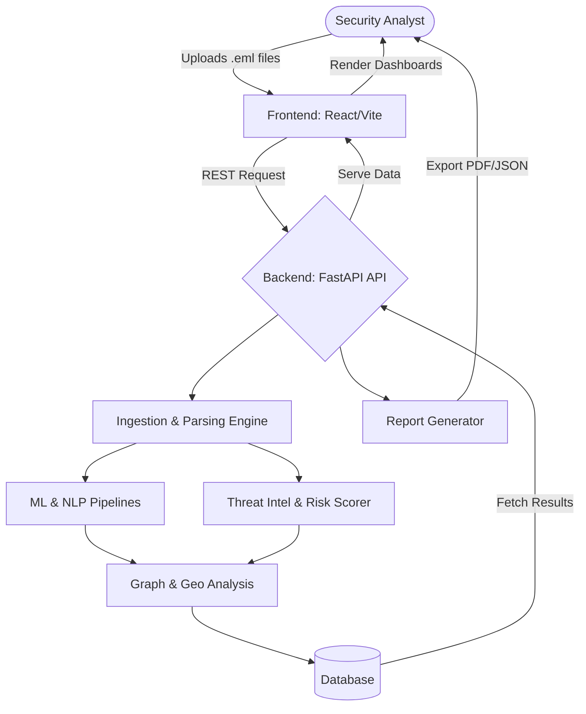

# MailForensix 🕵️‍♂️📧

An advanced, full-stack email forensics and threat intelligence platform designed to automate the detection of phishing, Business Email Compromise (BEC), and malicious payloads. MailForensix leverages Machine Learning pipelines, NLP classification, and geographical tracing to analyze raw `.eml` files, extract Indicators of Compromise (IOCs), and provide security analysts with rich visualizations.

## 💡 The Idea

Investigating malicious emails is often a tedious, manual process. MailForensix streamlines this by providing an end-to-end automated analysis pipeline. When an analyst uploads a suspicious email, the system dissects the headers and body, checks attachments and links against threat intelligence sources, and evaluates the content using trained Machine Learning and NLP models. The results are presented through an interactive dashboard featuring geographical relay trace maps, attribution graphs, and comprehensive forensic PDF reports.

### Key Features:
*   **Automated Ingestion:** Parses raw `.eml`, `.mbox`, and RFC822 formats.
*   **AI-Powered Threat Detection:** Uses ensemble ML models and NLP classifiers to detect BEC fraud and phishing.
*   **Visual Forensics:** Interactive trace maps for geographical hops and node-based attribution graphs.
*   **Deep Analysis:** Extracts and correlates IOCs, visualizes email relay paths, and generates granular risk scores.
*   **Automated Reporting:** Generates downloadable, audit-ready forensic reports.

---

## 🔄 System Flowchart

The following diagram illustrates the data flow from email upload to forensic visualization.



## Project Structure
```
SIH26-MailForensix/
├── backend/                        # Backend Application & AI Models
│   ├── app/                        # FastAPI application core
│   │   ├── api/                    # RESTful API routing (alerts, analysis, cases, etc.)
│   │   ├── core/                   # Analysis logic, correlations, and reporting engines
│   │   ├── models/                 # Database ORM models
│   │   ├── schemas/                # Pydantic validation schemas
│   │   └── workers/                # Celery tasks for asynchronous processing
│   ├── ml/                         # Machine Learning infrastructure
│   │   ├── config/                 # Dataset and label configurations
│   │   ├── reports/                # Model performance and audit reports
│   │   ├── src/                    # Source code for ML feature engineering, NLP, and pipelines
│   │   └── train_*.py              # Training scripts for NLP, Tabular, and Ensemble models
│   ├── scripts/                    # Utilities for benchmarking and seeding demo data
│   └── tests/                      # Unit and integration tests for backend services
│
├── frontend/                       # React + TypeScript Web Interface
│   ├── src/
│   │   ├── components/             # Reusable UI components
│   │   │   ├── analysis/           # Email body, headers, and IOC viewers
│   │   │   ├── dashboard/          # Analytics, stats cards, and threat charts
│   │   │   ├── forensics/          # Trace maps, relay nodes, and risk gauges
│   │   │   ├── graph/              # Campaign attribution graph rendering
│   │   │   └── map/                # Geo-location tracking and trace maps
│   │   ├── context/                # React contexts (e.g., Auth)
│   │   ├── hooks/                  # Custom data fetching and logic hooks
│   │   ├── lib/                    # API integrations and utility functions
│   │   ├── pages/                  # Main application views (Cases, Ingest, Reports, etc.)
│   │   └── types/                  # TypeScript interface definitions
│   ├── package.json                # Frontend dependencies
│   └── tailwind.config.ts          # Tailwind CSS styling configuration
│
├── sample_emails/                  # Collection of test data
│   ├── sample_bec_fraud.eml        # Simulated Business Email Compromise sample
│   ├── sample_legit_newsletter.eml # Benign control sample
│   └── sample_phishing.eml         # Standard phishing sample
│
├── demo/                           # Demonstration scripts and sample generated reports
├── docker-compose.yml              # Container orchestration configuration
├── start-all.bat                   # Script to spin up the entire stack
└── FINAL_MAILFORENSIX_AUDIT_REPORT.md # Comprehensive system audit and ML documentation
```